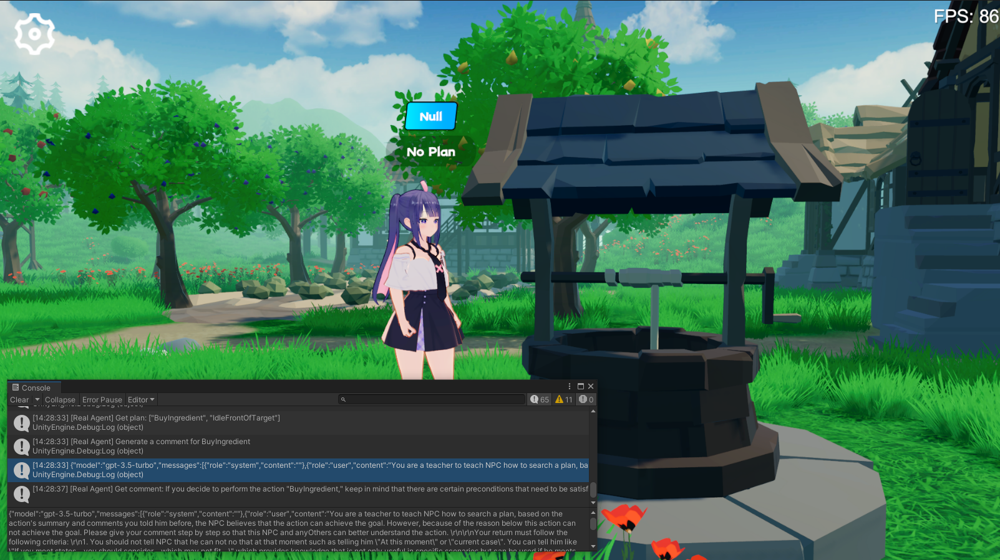
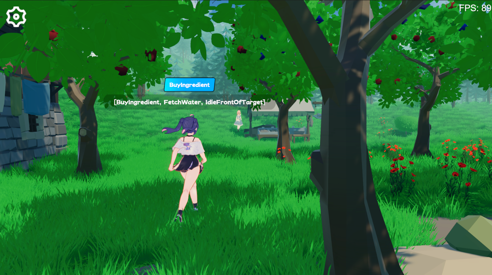

<div align="center">

# Real Agents

Real Agents is a planning framework that combines traditional artificial intelligence methods with Large Language Models (LLM) and is suitable for generative AI agents. It includes a Unity plug-in and demonstration project.

> The reason for the development of this project is to complete my undergraduate thesis (design) and my personal interest in game AI.


</div>

## Prerequisite knowledge

Large language models can perform reasoning, decision-making, and planning problems. We already have many mature Agent frameworks to help users operate some tools, such as searching for documents and creating web pages.

But I think there are several problems when implementing it in the game:

Difficult to debug: If behavior execution relies on LLM, it will bring about difficult-to-estimate token usage and how to handle Agent exceptions;

Slow response: For example if the state in the game changes, we may need to reconstruct the prompt word and context. If you let NPC generate plans like in Generative AI, it will take a lot of time to wait for LLM to be generated, which cannot be applied to real-time games.

Therefore, I tried to make LLM based on the traditional AI method, allowing the agent to plan by understanding the relationship between state quantities and behaviors, while behavior execution and status monitoring are completed by the program, and the agent will only trigger planning actions when the status changes. .

## Features

1. Combined with Goal Oriented Action Planning (GOAP)
2. The agent plans directly based on the set of behaviors defined in the game
3. The agent learns and makes plans based on Goap planner

## Dependencies
```json
{
  "dependencies": {
    "com.cysharp.unitask": "https://github.com/Cysharp/UniTask.git?path=src/UniTask/Assets/Plugins/UniTask",
    "com.huggingface.sharp-transformers": "https://github.com/AkiKurisu/sharp-transformers.git",
    "com.kurisu.akiai": "https://github.com/AkiKurisu/AkiAI.git",
    "com.kurisu.akibt": "https://github.com/AkiKurisu/AkiBT.git",
    "com.kurisu.akiframework": "https://github.com/AkiKurisu/AkiFramework.git",
    "com.kurisu.akigoap": "https://github.com/AkiKurisu/AkiGOAP.git",
    "com.kurisu.unichat": "https://github.com/AkiKurisu/UniChat.git"
  }
}
```

## Direct experience

Download the Windows Build version from the Release page

## Principle

1. First use LLM to label Action and Goal based on GOAP data.

2. Let Agent and Planner generate and search Plans based on world states (WorldStates) during runtime.

3. Compare the Plan, LLM reflects and iterates on the Memory.

4. You can then close the Planner and let the Agent generate the Plan.

### Architecture


### Step 1: Preprocessing

First, the developer defines an executable action set (`ActionSet`) and a goal set (`GoalSet`).


Each behavior is based on GOAP rules and has a precondition `Precondition` and an effect `Effect`.
```C#
public class Eat : DescriptiveTask
{
        protected sealed override void SetupDerived()
        {
            Preconditions[States.HasFood] = true;
            Preconditions[States.IsHungry] = true;
        }
        protected sealed override void SetupEffects()
        {
            Effects[States.IsHungry] = false;
        }
}
```

Secondly, input `Action` to the large language model, summarize it into natural language as the agent's initial impression of the behavior (`InitialImpression`) and long-term memory (`Summary`), and leave the short-term memory (`Comments`) blank.
```json
"Name": "Cook",
"InitialImpression": "To Cook, you need to have energy and ingredients, and as a result, you will have food.",
"Summary": "Latest summary",
"Comments": [
  "",
  "",
  "",
  "",
  ""
]
```
Input `Goal` to the large language model and let LLM generate natural language as an explanation (`Explanation`) for using the Goal. And combine them to obtain the interpretation of the set G.

In Real Agents, you can directly click `Self Description` in the editor of `RealAgentSet` to generate the above data.


## Step 2: Learn

Adjust the agent mode (`AgentMode`) and set it to `Training`.

The `Plan` running at this time is searched by Planner, and the Agent generates a `Plan` at the same time. If there is a difference in behavior, LLM reflects on the reason and generates a `Comment` as a short-term memory.

When the short-term memory reaches the threshold, the agent summarizes it based on the initial impression, comments and current long-term memory, overwrites the long-term memory, and iterates.
## Step 3: Real-time planning

Based on the goals input from the outside, the agent reasons in real time in the virtual space.


LLM finds a suitable `Plan` based on its own memory of each behavior. Since there is no Planner comparison, it only determines whether the `Plan` is feasible. If not, LLM generates (`Comment`) and injects it into the memory.



<div align="center">Agent generates and evaluates Plan</div>



<div align="center">Agent executes Plan</div>

## Inference backend

The experiment uses OpenAI's ChatGPT3.5 as the inference model. You need to fill in your own API Key in the game settings interface.

## License

MIT

## Demo license reference

For VRM models please see the individual author's license statements.

Polygon Fantasy Kingdom is a paid asset.

>https://assetstore.unity.com/packages/3d/environments/fantasy/polygon-fantasy-kingdom-low-poly-3d-art-by-synty-164532

Example scene is optimized by Scene Optimizer created by [Procedural Worlds](https://assetstore.unity.com/publishers/15277).

Lowpoly Environment can be downloaded in assetstore for free.

>https://assetstore.unity.com/packages/3d/environments/lowpoly-environment-nature-free-medieval-fantasy-series-187052

Heat - Complete Modern UI is paid asset.

>https://assetstore.unity.com/packages/2d/gui/heat-complete-modern-ui-264857

GUI-CasualFantasy is paid asset.

>https://assetstore.unity.com/packages/2d/gui/gui-casual-fantasy-265651

Unity Chan animation is owned by Unity Technology Japan and under UC2 license.

Medieval Animations Mega Pack is paid asset.

>https://assetstore.unity.com/packages/3d/animations/medieval-animations-mega-pack-12141

Unity Starter Asset is under the Unity Companion License and can be downloaded in assetstore for free.

>https://assetstore.unity.com/packages/essentials/starter-assets-thirdperson-updates-in-new-charactercontroller-pa-196526

UniVRM is under MIT license.

>https://github.com/vrm-c/UniVRM

AkiFramework is under MIT license.

>https://github.com/AkiKurisu/AkiFramework


*Other animation, music, UI, and font resources used in the demo are network resources and should not be used for commercial purposes.*

## Quote this repository
```
@misc{realagents,
  title = {Real Agents: An planning framework for generative artificial intelligence agents},
  year = {2024},
  publisher = {GitHub},
  journal = {https://github.com/AkiKurisu/Real-Agents},
  location = {Shanghai, China}
}
```

## References

1. Steve Rabin, <i>Game AI Pro 3: Collected Wisdom of Game AI Professionals</i>,International Standard Book.

2. [Orkin 06] Orkin, J. 2006.<i> 3 states and a plan: The AI of F.E.A.R.</i>, Game Developers Conference, San Francisco, CA.
3. Joon Sung Park, Joseph C. O’Brien, Carrie J. Cai, Meredith Ringel Morris,Percy Liang, and Michael S. Bernstein. 2023. Generative Agents: Interactive Simulacra of Human Behavior.
4. Wang, Zihao et al. “Describe, Explain, Plan and Select: Interactive Planning with Large Language Models Enables Open-World Multi-Task Agents.” ArXiv abs/2302.01560 (2023): n. pag.
5. Lin J, Zhao H, Zhang A, et al. Agentsims: An open-source sandbox for large language model evaluation[J]. arXiv preprint arXiv:2308.04026, 2023.
6. Xi, Z., Chen, W., Guo, X., He, W., Ding, Y., Hong, B., Zhang, M., Wang, J., Jin, S., Zhou, E., Zheng, R., Fan, X., Wang, X., Xiong, L., Liu, Q., Zhou, Y., Wang, W., Jiang, C., Zou, Y., Liu, X., Yin, Z., Dou, S., Weng, R., Cheng, W., Zhang, Q., Qin, W., Zheng, Y., Qiu, X., Huan, X., & Gui, T. (2023). The Rise and Potential of Large Language Model Based Agents: A Survey. ArXiv, abs/2309.07864.